# Webhook Dead-Letter Vault (WDLV)

[](https://opensource.org/licenses/MIT)
[](https://nodejs.org/)
[](https://filecoin.io/)

**Never lose another webhook. Ever.**

Webhook Dead-Letter Vault is a bulletproof webhook relay service built on Filecoin Onchain Cloud that automatically captures, stores, and replays failed webhook events with cryptographic integrity guarantees.

## 🚨 The Problem

Webhooks fail. When they do, it's silent, costly, and often undetected until customers complain:

- **23% of webhooks fail in production** across all major providers
- Failed payment webhooks = lost revenue, chargebacks, customer churn
- Failed integration webhooks = broken workflows, data inconsistencies
- Most startups have **zero retry logic or dead-letter storage**

**Real impact:** Stripe, Shopify, and AWS all invest heavily in retry infrastructure because webhook failures are *expected*, not exceptional.

## ✨ The Solution

WDLV transforms fragile webhooks into **immortal event streams** with one line of code:

```javascript
// Before: Hope and pray 🙏
webhook.send(payload)

// After: Bulletproof reliability 🛡️
webhook.via('wdlv://your-vault-id').send(payload)
```

### Key Features

- **🛡️ Automatic Vaulting** - Failed webhooks instantly stored in Filecoin
- **🔄 Smart Retries** - Exponential backoff with configurable policies
- **📋 Audit Trail** - Immutable history with cryptographic proofs
- **⚡ Fast Replay** - On-demand event replay via FilCDN
- **💰 Usage-Based Pricing** - Pay only for failed events via Filecoin Pay
- **🔍 Real-Time Monitoring** - Live dashboard showing vault activity

## 🏗️ Architecture

```mermaid
graph TB
    A[Your App] --> B[WDLV Relay]
    B --> C{Webhook Delivery}
    C -->|Success| D[✅ Complete]
    C -->|Failure| E[Filecoin Warm Storage]
    E --> F[PDP Verification]
    F --> G[Retry Queue]
    G --> H[FilCDN Retrieval]
    H --> I[Smart Retry]
    I --> C
```



**Powered by Filecoin Onchain Cloud:**
- **FilecoinWarmStorage** - Immutable webhook payload storage
- **PDP (Proof of Data Possession)** - Cryptographic integrity verification
- **FilCDN** - Global edge delivery for instant replay
- **Filecoin Pay** - Streaming micropayments for usage
- **Synapse SDK** - Unified developer experience

## 🚀 Quick Start

### Installation

```bash
npm install webhook-dead-letter-vault
```

### Basic Usage

```javascript
import { WebhookVault } from 'webhook-dead-letter-vault'

const vault = new WebhookVault({
  vaultId: 'your-vault-id',
  filecoin: {
    warmStorage: true,
    cdnReplay: true,
    payStreaming: true
  }
})

// Send webhook with automatic vaulting on failure
await vault.relay({
  url: 'https://api.yourapp.com/webhooks/payment',
  payload: { event: 'payment.succeeded', amount: 5000 },
  headers: { 'x-signature': 'sha256=...' }
})
```

### Advanced Configuration

```javascript
const vault = new WebhookVault({
  vaultId: 'your-vault-id',
  retryPolicy: {
    maxAttempts: 5,
    backoffMultiplier: 2,
    maxDelay: 3600 // 1 hour
  },
  onFail: (event) => console.log(`Vaulted: ${event.id}`),
  onRetry: (event) => console.log(`Retry #${event.attempt}`),
  onSuccess: (event) => console.log(`Delivered: ${event.id}`)
})
```

## 📊 Dashboard

Monitor your webhook reliability in real-time:

```
🟢 HEALTHY WEBHOOKS: 1,247 delivered (98.2%)
🔴 VAULTED EVENTS: 23 failed, auto-retrying
🔄 ACTIVE RETRIES: 3 in progress
📈 SUCCESS RATE: 99.8% after retries

Recent Activity:
✅ stripe.payment_intent.succeeded - Delivered in 145ms
🔴 shopify.order.created - Failed, vaulted, retry in 30s
✅ twilio.sms.delivered - Delivered in 89ms
```

## 🛠️ Development

### Prerequisites

- Node.js 16+
- Filecoin Onchain Cloud account
- Environment variables configured

### Setup

```bash
# Clone the repository
git clone https://github.com/your-org/webhook-dead-letter-vault.git
cd webhook-dead-letter-vault

# Install dependencies
npm install

# Copy environment template
cp .env.example .env

# Configure your Filecoin credentials
# FILECOIN_WARM_STORAGE_API_KEY=your_key
# FILECOIN_PAY_WALLET_ADDRESS=your_address
# VAULT_ENCRYPTION_KEY=your_encryption_key
```

### Environment Variables

```bash
# Filecoin Onchain Cloud
FILECOIN_WARM_STORAGE_API_KEY=     # Warm storage service key
FILECOIN_CDN_API_KEY=              # FilCDN access key  
FILECOIN_PAY_WALLET_ADDRESS=       # Payment wallet address
SYNAPSE_SDK_KEY=                   # Synapse SDK key

# Vault Configuration
VAULT_ENCRYPTION_KEY=              # AES-256 encryption key
DEFAULT_RETRY_ATTEMPTS=5           # Default max retry attempts
DEFAULT_BACKOFF_MULTIPLIER=2       # Exponential backoff multiplier

# Dashboard (Optional)
DASHBOARD_PORT=3000                # Dashboard server port
DASHBOARD_AUTH_TOKEN=              # Dashboard authentication token
```

### Running Locally

```bash
# Start the vault service
npm run dev

# Run tests
npm test

# Start dashboard
npm run dashboard

# Lint and format
npm run lint
npm run format
```

## 📦 API Reference

### WebhookVault Class

#### Constructor Options

| Option | Type | Description | Default |
|--------|------|-------------|---------|
| `vaultId` | `string` | Unique identifier for your vault | Required |
| `retryPolicy` | `RetryPolicy` | Retry configuration | See defaults |
| `filecoin` | `FilecoinConfig` | Filecoin service settings | `{}` |

#### Methods

##### `relay(options)`

Send a webhook with automatic vaulting on failure.

```javascript
await vault.relay({
  url: 'https://example.com/webhook',
  payload: { data: 'value' },
  headers: { 'Authorization': 'Bearer token' },
  timeout: 30000,
  idempotencyKey: 'unique-key'
})
```

##### `replay(eventId)`

Manually replay a vaulted webhook event.

```javascript
const result = await vault.replay('event_123')
console.log(result.status) // 'success' | 'failed' | 'retrying'
```

##### `getVaultStats()`

Get vault statistics and health metrics.

```javascript
const stats = await vault.getVaultStats()
// { totalEvents, successRate, vaultedEvents, activeRetries }
```

## 🧪 Testing

The project includes comprehensive tests covering:

- Webhook delivery and failure scenarios
- Filecoin storage integration
- Retry logic and backoff policies
- Dashboard functionality
- Error handling and edge cases

```bash
# Run all tests
npm test

# Run specific test suite
npm test -- --grep "vault storage"

# Run tests with coverage
npm run test:coverage
```

## 🚢 Deployment

### Docker

```bash
# Build image
docker build -t webhook-vault .

# Run container
docker run -p 3000:3000 \
  -e FILECOIN_WARM_STORAGE_API_KEY=your_key \
  -e VAULT_ENCRYPTION_KEY=your_key \
  webhook-vault
```

### Production Considerations

- **Scaling**: Deploy multiple instances behind a load balancer
- **Monitoring**: Integrate with your observability stack (Prometheus, Grafana)
- **Security**: Rotate encryption keys regularly
- **Backup**: Filecoin provides redundancy, but consider backup policies
- **Compliance**: Audit logs are immutable and cryptographically verified

## 🤝 Contributing

We welcome contributions! Please see our [Contributing Guide](CONTRIBUTING.md) for details.

### Development Workflow

1. Fork the repository
2. Create a feature branch (`git checkout -b feature/amazing-feature`)
3. Make your changes
4. Add tests for new functionality
5. Run the test suite (`npm test`)
6. Commit your changes (`git commit -m 'Add amazing feature'`)
7. Push to the branch (`git push origin feature/amazing-feature`)
8. Open a Pull Request

## 📋 Roadmap

### Wave 1: Foundation (Current)
- ✅ Core vault service with Filecoin integration
- ✅ Stripe webhook support
- ✅ Basic retry logic and dashboard
- 🔄 SDK and documentation

### Wave 2: Expansion
- 🔲 Support for Shopify, Twilio, and other major providers  
- 🔲 Advanced retry policies and custom rules
- 🔲 Webhook signature validation
- 🔲 Rate limiting and DDoS protection

### Wave 3: Enterprise
- 🔲 White-label solutions
- 🔲 Multi-tenant architecture
- 🔲 Advanced analytics and reporting
- 🔲 SLA guarantees and enterprise support

### Wave 4: Ecosystem
- 🔲 Plugin architecture for custom integrations
- 🔲 GraphQL API and real-time subscriptions
- 🔲 Mobile SDKs (iOS, Android)
- 🔲 Terraform provider for infrastructure-as-code

## 📄 License

This project is licensed under the MIT License - see the [LICENSE](LICENSE) file for details.

## 🆘 Support

- **Documentation**: [docs.webhook-vault.io](https://docs.webhook-vault.io)
- **Issues**: [GitHub Issues](https://github.com/your-org/webhook-dead-letter-vault/issues)
- **Discord**: [Join our community](https://discord.gg/webhook-vault)
- **Email**: support@webhook-vault.io

## 🏆 Built for WaveHack

This project was created for [Filecoin WaveHack](https://wavehack.filecoin.io/), showcasing the power of Filecoin Onchain Cloud for building reliable, decentralized infrastructure.

**Why Filecoin?**
- **Immutable Storage**: Webhook payloads are cryptographically guaranteed
- **Global Redundancy**: No single point of failure across 1000+ miners
- **Verifiable Integrity**: PDP proofs ensure data hasn't been tampered with
- **Edge Delivery**: FilCDN provides lightning-fast replay capabilities
- **Micropayments**: Pay only for what you use via Filecoin Pay

---

**Never lose another webhook. Ever.** 🛡️

Made with ❤️ by the Webhook Vault team
